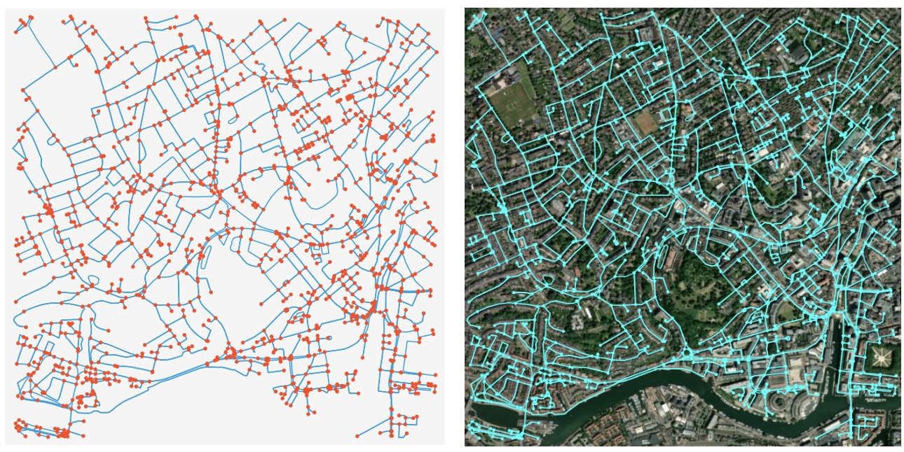
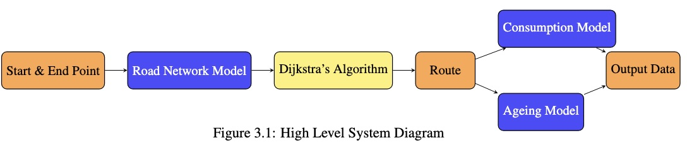

<!-- Improved compatibility of back to top link: See: https://github.com/othneildrew/Best-README-Template/pull/73 -->

<a id="readme-top"></a>

<!--
*** Thanks for checking out the Best-README-Template. If you have a suggestion
*** that would make this better, please fork the repo and create a pull request
*** or simply open an issue with the tag "enhancement".
*** Don't forget to give the project a star!
*** Thanks again! Now go create something AMAZING! :D
-->

<!-- PROJECT SHIELDS -->
<!--
*** I'm using markdown "reference style" links for readability.
*** Reference links are enclosed in brackets [ ] instead of parentheses ( ).
*** See the bottom of this document for the declaration of the reference variables
*** for contributors-url, forks-url, etc. This is an optional, concise syntax you may use.
*** https://www.markdownguide.org/basic-syntax/#reference-style-links
-->

<!-- PROJECT LOGO -->
<br />
<div align="center">
  <a href="images/sat_map.jpg">
    
  </a>

  <h3 align="center">Optimised Route-Planning</h3>

  <p align="center">
    Modelling the impacts of an optimised route-planning algorithm on battery health and energy consumption for an EV
  </p>
</div>

<!-- TABLE OF CONTENTS -->
<details>
  <summary>Table of Contents</summary>
  <ol>
    <li>
      <a href="#about-the-project">About The Project</a>
      <ul>
        <li><a href="#built-with">Built With</a></li>
      </ul>
    </li>
    <li>
      <a href="#getting-started">Getting Started</a>
      <ul>
        <li><a href="#prerequisites">Prerequisites</a></li>
        <li><a href="#installation">Installation</a></li>
      </ul>
    </li>
    <li><a href="#usage">Usage</a></li>
    <li><a href="#roadmap">Roadmap</a></li>
    <li><a href="#contact">Contact</a></li>
    <li><a href="#acknowledgments">Acknowledgments</a></li>
  </ol>
</details>

<!-- ABOUT THE PROJECT -->

## About The Project

<div align="center">
  <a href="images/systemdiagram.jpg">
    
  </a>
</div>

This project was used to model the impact of an optimised route-planning algorithm on battery health and energy consumption for an eCargo bike. All simulations were ran using code in this repository. This version has the essential models to run simulations, with notebooks used to run the overall end of life simulations and validation studies. The overall system can be seen in the image above. This image shows:

- A road network model: built using OSM and Google Maps API data, compiled into a connected graph using Networkx.
- Dijkstra's Algorithm: shortest-path algorithm implemented with networkx and influenced by weight calculations made within this project.
- Consumption Model: model that takes road and vehicle characteristics as an input, and outputs energy demands.
- Ageing Model : model used to predict the degradation (in terms of capacity loss) of the EV battery using Peukert's relationship.

<!--
### Built With

This section should list any major frameworks/libraries used to bootstrap your project. Leave any add-ons/plugins for the acknowledgements section. Here are a few examples.

<!-- - [![Next][Next.js]][Next-url]
- [![React][React.js]][React-url]
- [![Vue][Vue.js]][Vue-url]
- [![Angular][Angular.io]][Angular-url]
- [![Svelte][Svelte.dev]][Svelte-url]
- [![Laravel][Laravel.com]][Laravel-url]
- [![Bootstrap][Bootstrap.com]][Bootstrap-url]
- [![JQuery][JQuery.com]][JQuery-url] -->
<!--
<p align="right">(<a href="#readme-top">back to top</a>)</p> -->

<!-- GETTING STARTED -->

## Getting Started

To get a local copy up and running follow these simple example steps.

### Installation

_Below is an example of how you can instruct your audience on installing and setting up your app. This template doesn't rely on any external dependencies or services._

1. Get a Google Maps Elevation API Key at [Google Cloud Platform](https://cloud.google.com/maps-platform/)
2. Clone the repo

   ```sh
   git clone https://github.com/github_username/repo_name.git
   ```

3. Install python packages
   ```sh
   pip install -r requirements.txt
   ```
4. Create a .env file in the project root and add your API key
   ```sh
   GOOGLE_API="YOUR_GOOGLE_MAPS_API_KEY"
   ```
5. Change git remote url to avoid accidental pushes to base project
   ```sh
   git remote set-url origin github_username/repo_name
   git remote -v # confirm the changes
   ```
   <p align="right">(<a href="#readme-top">back to top</a>)</p>

<!-- USAGE EXAMPLES -->

## Usage

### Simulate Routes

The main.py file is set up to simulate and analyse a random route from the network. Run this file to visualise a random route and see the consumption, distance, and climb for a given route.

### Adapt to different network

Inside 'data_collection/data_acquisition', find scripts used to pull, process, and store the data for a given map. Set a different central point, with a different radius if needed, to process and download necessary data.

```python
central_point = (51.456127, -2.608071) #latitude, longitude
G = ox.graph_from_point(central_point, dist=500, network_type='bike')
```

### Optimise Weight Calculation

The optimise-weights.ipnyb notebook was used to optimise weights, using parallelised simulations. These resulting weights are stored in the weights.json inside the data_collection directory. If needed, re-run the ipnyb notebook and replace these weights with the new weights calculated.

### Change vehicle data

Inside the models/vehicle_models directory are three json files with data used to model the specific vehicle for this project. Change this data to model a different vehicle.

<p align="right">(<a href="#readme-top">back to top</a>)</p>

## Key Resources

Use this space to list resources you find helpful and would like to give credit to. I've included a few of my favorites to kick things off!

- [Open Street Maps (OSM)](https://www.openstreetmap.org/)
- [OSMnx Documentation](https://osmnx.readthedocs.io)
- [Networkx Documentation](https://networkx.org/)
- [Google Maps Elevation API](https://developers.google.com/maps/documentation/elevation/start)
<p align="right">(<a href="#readme-top">back to top</a>)</p>
<!-- ROADMAP -->
<!--

<!-- ## Roadmap

- [x] Add Changelog
- [x] Add back to top links
- [ ] Add Additional Templates w/ Examples
- [ ] Add "components" document to easily copy & paste sections of the readme
- [ ] Multi-language Support
- [ ] Chinese
- [ ] Spanish

See the [open issues](https://github.com/othneildrew/Best-README-Template/issues) for a full list of proposed features (and known issues). -->

<p align="right">(<a href="#readme-top">back to top</a>)</p> -->

<!-- CONTRIBUTING -->

## Contact

Aron Finkelstein - finkelstein.aron@gmail.com

<p align="right">(<a href="#readme-top">back to top</a>)</p>

<!-- ACKNOWLEDGMENTS -->

<!-- MARKDOWN LINKS & IMAGES -->
<!-- https://www.markdownguide.org/basic-syntax/#reference-style-links -->
<!--
[contributors-shield]: https://img.shields.io/github/contributors/othneildrew/Best-README-Template.svg?style=for-the-badge
[contributors-url]: https://github.com/othneildrew/Best-README-Template/graphs/contributors
[forks-shield]: https://img.shields.io/github/forks/othneildrew/Best-README-Template.svg?style=for-the-badge
[forks-url]: https://github.com/othneildrew/Best-README-Template/network/members
[stars-shield]: https://img.shields.io/github/stars/othneildrew/Best-README-Template.svg?style=for-the-badge
[stars-url]: https://github.com/othneildrew/Best-README-Template/stargazers
[issues-shield]: https://img.shields.io/github/issues/othneildrew/Best-README-Template.svg?style=for-the-badge
[issues-url]: https://github.com/othneildrew/Best-README-Template/issues
[license-shield]: https://img.shields.io/github/license/othneildrew/Best-README-Template.svg?style=for-the-badge
[license-url]: https://github.com/othneildrew/Best-README-Template/blob/master/LICENSE.txt
[linkedin-shield]: https://img.shields.io/badge/-LinkedIn-black.svg?style=for-the-badge&logo=linkedin&colorB=555
[linkedin-url]: https://linkedin.com/in/othneildrew
[product-screenshot]: images/screenshot.png
[Next.js]: https://img.shields.io/badge/next.js-000000?style=for-the-badge&logo=nextdotjs&logoColor=white
[Next-url]: https://nextjs.org/
[React.js]: https://img.shields.io/badge/React-20232A?style=for-the-badge&logo=react&logoColor=61DAFB
[React-url]: https://reactjs.org/
[Vue.js]: https://img.shields.io/badge/Vue.js-35495E?style=for-the-badge&logo=vuedotjs&logoColor=4FC08D
[Vue-url]: https://vuejs.org/
[Angular.io]: https://img.shields.io/badge/Angular-DD0031?style=for-the-badge&logo=angular&logoColor=white
[Angular-url]: https://angular.io/
[Svelte.dev]: https://img.shields.io/badge/Svelte-4A4A55?style=for-the-badge&logo=svelte&logoColor=FF3E00
[Svelte-url]: https://svelte.dev/
[Laravel.com]: https://img.shields.io/badge/Laravel-FF2D20?style=for-the-badge&logo=laravel&logoColor=white
[Laravel-url]: https://laravel.com
[Bootstrap.com]: https://img.shields.io/badge/Bootstrap-563D7C?style=for-the-badge&logo=bootstrap&logoColor=white
[Bootstrap-url]: https://getbootstrap.com
[JQuery.com]: https://img.shields.io/badge/jQuery-0769AD?style=for-the-badge&logo=jquery&logoColor=white
[JQuery-url]: https://jquery.com -->

```

```
